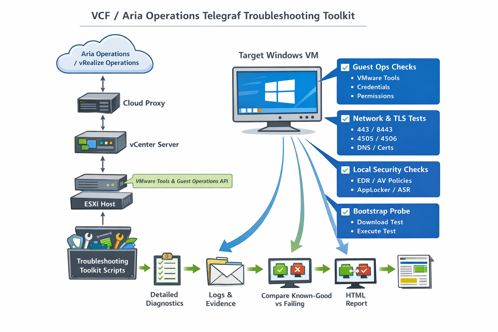
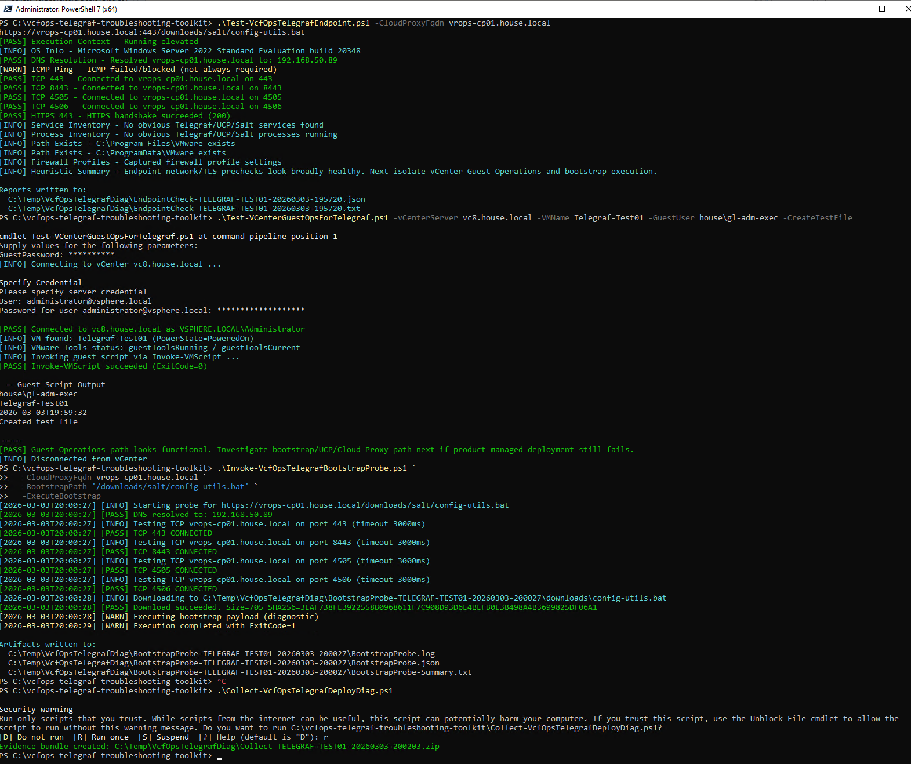
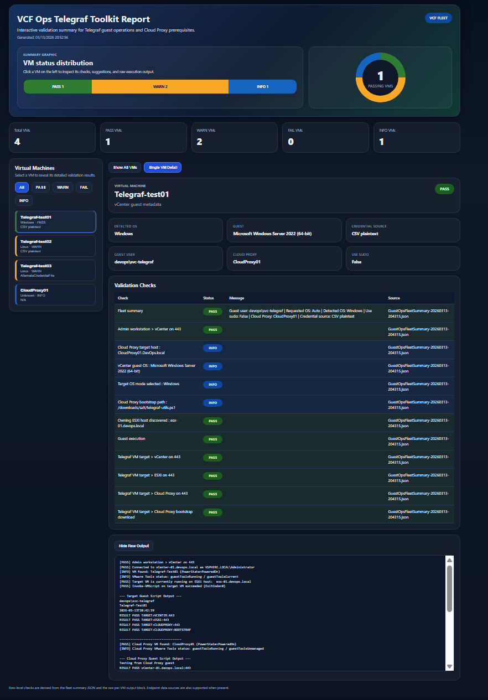

# VCF Operations Telegraf Toolkit v3.0

PowerShell toolkit for troubleshooting **product-managed Telegraf agent deployment** in **VCF Operations / Aria Operations** environments across **Windows** and **Linux** endpoints.

This toolkit helps isolate where deployment is failing by testing the same dependency chain the platform relies on: **vCenter Guest Operations, VMware Tools, Cloud Proxy reachability, DNS, HTTPS/TLS trust, bootstrap download paths, and local endpoint execution**.

<p align="left">
  
  
  
  
</p>

---

## Why this toolkit exists

When a product-managed Telegraf deployment fails, the root cause is often not “Telegraf” itself. The failure usually sits somewhere in the path around it, such as:

- **vCenter Guest Operations** permissions, credentials, or VMware Tools health
- **Cloud Proxy connectivity** on the required ports
- **DNS resolution** or hostname mismatches
- **HTTPS/TLS trust** problems, certificate chain issues, or SSL inspection
- **Bootstrap delivery** failures for the expected Cloud Proxy path
- **Endpoint-side execution controls** such as AV, EDR, policy, or sudo restrictions

This toolkit gives you a repeatable way to validate those layers, collect evidence, and generate a report that can be shared with platform, firewall, security, or support teams.



---

## What changed in v3.0

Version 3.0 reflects a substantial refresh of the toolkit:

- **Guest Ops fleet testing** now supports Windows and Linux targets from the same CSV
- **Credential handling** supports:
  - plaintext CSV credentials when you accept the risk
  - DPAPI-protected credential files
  - per-VM credential overrides using `AltCredFile`
- **Cloud Proxy hostname logic** no longer assumes a fixed DNS suffix and can use guest-reported hostname/FQDN data
- **HTML reporting** now supports the newer interactive dashboard style with:
  - summary graphics
  - clickable VM drill-down
  - Show All VMs overview
  - dark blue theme
- **Guest Ops fleet output** and **vCenter fleet output** can both be parsed by the same HTML report script
- Help output has been improved across the scripts with `-h`, `-Full`, and `-Examples`

Because the report UX and Guest Ops workflow changed significantly, this release is documented as **v3.0**.

---

## Repository layout

```text
.
├── Invoke-VcfOpsFleetGuestOps.ps1
├── New-VcfOpsTelegrafHtmlReport.ps1
├── Save-VcfOpsTelegrafCredential.ps1
├── Test-VCenterGuestOpsForTelegraf.ps1
├── ExampleSingleVMtestingCommands.png
├── Example-Fleet-targets.csv
├── Example-Fleet-Report.png
├── Example-GuestFleetReport.html
├── Example-VcfFleetReport.gif
├── Telegraf-toolkit-workflow.png
├── toolkit-report-example.png
└── EndPointTests
    ├── Collect-VcfOpsTelegrafDeployDiag.ps1
    ├── Invoke-VcfOpsTelegrafBootstrapProbe.ps1
    └── Test-VcfOpsTelegrafEndpoint.ps1
```

> The endpoint-executed scripts are stored in the `EndPointTests` folder for organisation, but when scripts refer to each other in help text or workflow examples they are referenced by script name only.

---

## Toolkit workflow at a glance

The toolkit supports two main ways of working.

### 1. Single VM / deep-dive troubleshooting

Use this when you want to validate one VM thoroughly.

- `Test-VCenterGuestOpsForTelegraf.ps1`
  - Connects to vCenter
  - Uses VMware Guest Operations to run tests inside a single guest
  - Auto-detects Windows or Linux when requested
  - Can also validate Cloud Proxy guest-side connectivity

- `Test-VcfOpsTelegrafEndpoint.ps1`
  - Runs locally on an endpoint
  - Tests endpoint-to-Cloud Proxy connectivity, HTTPS, DNS, and local indicators

- `Invoke-VcfOpsTelegrafBootstrapProbe.ps1`
  - Focused local diagnostic for the bootstrap URL path
  - Useful when you want to isolate transport/download behaviour separately

- `Collect-VcfOpsTelegrafDeployDiag.ps1`
  - Collects a local Windows diagnostic bundle after failure or warning conditions

### 2. Fleet-level Guest Ops validation and reporting

Use this when you want a single workflow across many VMs.

- `Invoke-VcfOpsFleetGuestOps.ps1`
  - Reads a CSV of VM targets
  - Auto-detects Windows or Linux per VM using vCenter guest metadata
  - Uses VMware Tools / `Invoke-VMScript` to run the correct guest-side tests
  - Produces fleet CSV and JSON outputs

- `New-VcfOpsTelegrafHtmlReport.ps1`
  - Converts compatible fleet JSON/CSV outputs into an interactive HTML report
  - Works with both Guest Ops fleet data and vCenter fleet-style data

---

## Core scripts

### `Invoke-VcfOpsFleetGuestOps.ps1`

The main **fleet Guest Ops runner**.

What it does:

- Connects to vCenter
- Reads a CSV of targets
- Determines whether each VM is Windows or Linux
- Resolves the Cloud Proxy hostname or FQDN
- Uses VMware Guest Operations to run:
  - PowerShell inside Windows guests
  - Bash inside Linux guests
- Tests connectivity and bootstrap behaviour
- Produces:
  - `GuestOpsFleetSummary-<timestamp>.json`
  - `GuestOpsFleetSummary-<timestamp>.csv`

This is the primary script to use when you want fleet-wide testing and HTML-ready output.

### `Test-VCenterGuestOpsForTelegraf.ps1`

The main **single-VM Guest Ops validator**.

What it does:

- Connects to vCenter
- Validates one target VM in detail
- Uses VMware Tools guest metadata to determine Windows or Linux when `-TargetOs Auto` is used
- Executes a guest-side test script with `Invoke-VMScript`
- Optionally validates Cloud Proxy guest-side connectivity as well
- Prints a detailed grouped validation summary

Use this when you want the most detailed troubleshooting output for a single VM.

### `New-VcfOpsTelegrafHtmlReport.ps1`

The **interactive HTML report generator**.

What it does:

- Reads a compatible fleet summary JSON/CSV file, or a folder containing supported result files
- Builds a dark-blue dashboard style HTML report
- Supports:
  - summary counters
  - status graphics
  - Show All VMs view
  - single-VM drill-down view
  - raw output expansion

### `Save-VcfOpsTelegrafCredential.ps1`

Creates **DPAPI-protected credential files** for later use by the fleet runner.

What it does:

- Prompts with `Get-Credential`
- Saves the credential to CLIXML with `Export-Clixml`
- On Windows, protects the password using DPAPI for the current Windows user on the current machine

This is the preferred way to avoid storing guest passwords in plaintext in the CSV.

---

## Endpoint-executed scripts

### `Test-VcfOpsTelegrafEndpoint.ps1`

Runs directly on a Windows or Linux endpoint.

What it does:

- Tests DNS resolution to the Cloud Proxy FQDN
- Tests TCP connectivity to key Cloud Proxy ports
- Tests HTTPS reachability
- Performs OS-specific local checks
- Produces endpoint JSON and text output

### `Invoke-VcfOpsTelegrafBootstrapProbe.ps1`

Runs directly on an endpoint.

What it does:

- Tests the bootstrap URL path to the Cloud Proxy
- Downloads the expected bootstrap payload
- Can optionally execute the downloaded payload for controlled diagnostics
- Helps distinguish:
  - URL/path problems
  - certificate trust issues
  - endpoint execution failures

### `Collect-VcfOpsTelegrafDeployDiag.ps1`

Runs locally on a Windows endpoint.

What it does:

- Collects local system, network, firewall, service, process, log, and file evidence
- Produces a timestamped folder and ZIP bundle
- Supports post-failure escalation and case building

---

## Credential handling

The fleet workflow supports several credential methods.

### Preferred method: DPAPI-protected credential files

Use `Save-VcfOpsTelegrafCredential.ps1` to create one or more credential files.

Examples:

```powershell
.\Save-VcfOpsTelegrafCredential.ps1 -Path C:\Secure\Guest-Windows.xml
.\Save-VcfOpsTelegrafCredential.ps1 -Path C:\Secure\Guest-Linux.xml
.\Save-VcfOpsTelegrafCredential.ps1 -Path C:\Secure\Telegraf-test03.xml
```

These can then be used in the fleet runner as:

- `-CredentialFile`
- `-WindowsCredentialFile`
- `-LinuxCredentialFile`
- `AltCredFile` in the CSV for a per-VM override

### Supported fallback: plaintext CSV credentials

If you accept the security tradeoff, the fleet runner can read:

- `GuestUser`
- `GuestPassword`

from the CSV.

This is easier to use, but the password is then stored in plaintext in the file.

### Credential precedence in the fleet runner

When using `Invoke-VcfOpsFleetGuestOps.ps1`, the effective precedence is:

1. `AltCredFile` from the CSV row
2. default credential file parameters, such as:
   - `-CredentialFile`
   - `-WindowsCredentialFile`
   - `-LinuxCredentialFile`
3. `GuestUser` and `GuestPassword` from the CSV

That means a specific VM can use a different account without changing the default Windows or Linux credential for the rest of the run.

---

## CSV format for fleet Guest Ops testing

Typical CSV columns:

```csv
VMName,GuestUser,GuestPassword,TargetOs,UseSudo,AltCredFile
Telegraf-test01,devops\DomainAdmin,P@ssw0rd123!,Auto,false,
Telegraf-test02,user,P@ssw0rd123!,Auto,false,
Telegraf-test03,,,Auto,false,C:\Secure\Telegraf-test03.xml
```

Column notes:

- `VMName`
  - target VM inventory name
- `GuestUser`
  - guest OS username, used only when no credential-file source applies
- `GuestPassword`
  - guest OS password, used only when no credential-file source applies
- `TargetOs`
  - `Auto`, `Windows`, or `Linux`
- `UseSudo`
  - Linux only; request additional checks using non-interactive sudo where appropriate
- `AltCredFile`
  - optional per-VM credential file override

---

## Cloud Proxy hostname logic

The toolkit no longer assumes a fixed DNS suffix such as `house.local`.

For Guest Ops fleet testing:

- if `-CloudProxyFqdn` is supplied, that value is used
- otherwise the fleet runner tries to resolve the Cloud Proxy hostname/FQDN from VMware guest metadata
- if that is not available, it falls back to the Cloud Proxy VM name

This makes the toolkit portable across environments where the DNS domain differs from the author’s original lab.

---

## Example usage

### Run a single-VM Guest Ops test

```powershell
$vcPw = ConvertTo-SecureString 'P@ssw0rd123!' -AsPlainText -Force
$guestPw = ConvertTo-SecureString 'P@ssw0rd123!' -AsPlainText -Force
$cpPw = ConvertTo-SecureString 'P@ssw0rd123!' -AsPlainText -Force

.\Test-VCenterGuestOpsForTelegraf.ps1 `
  -vCenterServer 'vCenter-01.devops.local' `
  -VMName 'Telegraf-test01' `
  -vCenterUser 'administrator@vsphere.local' `
  -vCenterPassword $vcPw `
  -GuestUser 'devops\DomainAdmin' `
  -GuestPassword $guestPw `
  -CloudProxyVmName 'CloudProxy-01' `
  -CloudProxyGuestUser 'root' `
  -CloudProxyGuestPassword $cpPw
```



### Run Guest Ops fleet testing with Windows and Linux credential files

```powershell
$vcPw = ConvertTo-SecureString 'P@ssw0rd123!' -AsPlainText -Force
$cpPw = ConvertTo-SecureString 'P@ssw0rd123!' -AsPlainText -Force

.\Invoke-VcfOpsFleetGuestOps.ps1 `
  -vCenterServer 'vCenter-01.devops.local' `
  -TargetsCsv '.\targets.csv' `
  -vCenterUser 'administrator@vsphere.local' `
  -vCenterPassword $vcPw `
  -CloudProxyVmName 'CloudProxy-01' `
  -CloudProxyGuestUser 'root' `
  -CloudProxyGuestPassword $cpPw `
  -WindowsCredentialFile 'C:\Secure\Guest-Windows.xml' `
  -LinuxCredentialFile 'C:\Secure\Guest-Linux.xml' `
  -OutDir '.'
```

### Run Guest Ops fleet testing using plaintext CSV credentials

```powershell
$vcPw = ConvertTo-SecureString 'P@ssw0rd123!' -AsPlainText -Force
$cpPw = ConvertTo-SecureString 'P@ssw0rd123!' -AsPlainText -Force

.\Invoke-VcfOpsFleetGuestOps.ps1 `
  -vCenterServer 'vCenter-01.devops.local' `
  -TargetsCsv '.\targets.csv' `
  -vCenterUser 'administrator@vsphere.local' `
  -vCenterPassword $vcPw `
  -CloudProxyVmName 'CloudProxy-01' `
  -CloudProxyGuestUser 'root' `
  -CloudProxyGuestPassword $cpPw `
  -OutDir '.'
```

### Generate the HTML report

```powershell
.\New-VcfOpsTelegrafHtmlReport.ps1 `
  -InputPath .\GuestOpsFleetSummary-20260313-204315.json `
  -OutputHtml .\GuestFleetReport.html
```

---

## Interactive report experience

The report output is one of the biggest changes in v3.0.

The HTML report now provides:

- a dark-blue themed dashboard
- summary graphics and counters
- status filters
- a **Show All VMs** view
- per-VM detail views
- expandable raw output

### Report overview



### Report interaction preview


### Included sample report

The repo also includes:

- `Example-GuestFleetReport.html`

so you can preview the report behaviour directly in a browser.

---

## Help built into the scripts

Most scripts in the toolkit support:

- `-h`
- `-Full`
- `-Examples`

Examples:

```powershell
.\Invoke-VcfOpsFleetGuestOps.ps1 -h
.\Invoke-VcfOpsFleetGuestOps.ps1 -Full
.\Invoke-VcfOpsFleetGuestOps.ps1 -Examples

.\New-VcfOpsTelegrafHtmlReport.ps1 -h
.\Save-VcfOpsTelegrafCredential.ps1 -Examples
.\Test-VCenterGuestOpsForTelegraf.ps1 -Full
```

---

## Typical troubleshooting workflow

### Option A: single VM deep dive

1. Run `Test-VCenterGuestOpsForTelegraf.ps1` against the affected VM
2. Review the grouped validation summary
3. If required, run `Test-VcfOpsTelegrafEndpoint.ps1` directly on the target
4. If needed, run `Collect-VcfOpsTelegrafDeployDiag.ps1` on the affected endpoint

### Option B: fleet validation and reporting

1. Create credential files with `Save-VcfOpsTelegrafCredential.ps1` or prepare a CSV with plaintext credentials
2. Build the target CSV
3. Run `Invoke-VcfOpsFleetGuestOps.ps1`
4. Generate the HTML report with `New-VcfOpsTelegrafHtmlReport.ps1`
5. Use the dashboard to identify PASS, WARN, and FAIL systems quickly

---

## Supportability note

This toolkit is intended for **diagnostics and troubleshooting** of **product-managed Telegraf deployment**.

It is **not** a replacement for the supported product-managed deployment workflow in VCF Operations / Aria Operations.

The bootstrap probe and manual endpoint scripts are intended to help identify root cause. Once the issue is understood and fixed, the final deployment should still be performed through the supported product workflow.

---

## License

This project is released under the **MIT License**.

See `LICENSE` for details.
