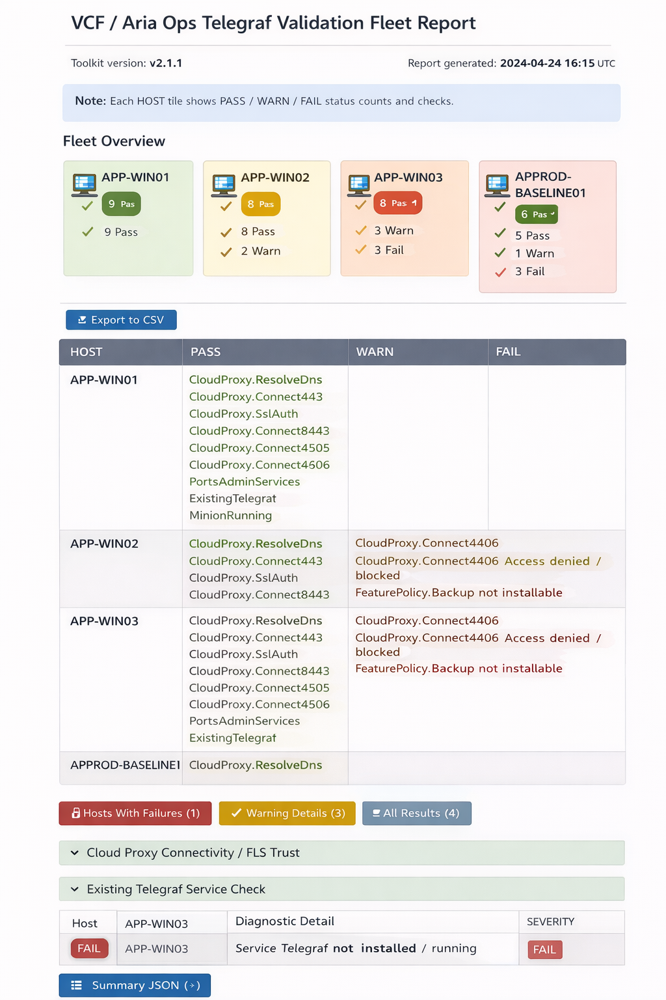

# VCF Operations / Aria Operations Telegraf Troubleshooting Toolkit (Windows)

**PowerShell toolkit for troubleshooting product-managed Telegraf agent deployment** in **VCF Operations / Aria Operations** environments (Windows endpoints).

This toolkit helps isolate which stage of the **product-managed Telegraf deployment flow** is failing by testing the same dependencies the product relies on (network, DNS, TLS, Guest Operations, bootstrap path, and endpoint execution), while still keeping the final deployment method **product-managed**.

<p align="left">
  
  
  
  
</p>

---

## Purpose

When a product-managed Telegraf deployment fails, the issue is often not “Telegraf” itself — it is usually one of the stages *around* it:

- **vCenter Guest Operations** (VMware Tools / guest credentials / permissions)
- **Cloud Proxy reachability** (ports, routing, firewall)
- **TLS / HTTPS trust** (certificate chain, SSL inspection, FQDN mismatch)
- **Managed control path** (registration/config push ports)
- **Endpoint security / policy** (EDR, AppLocker, Defender ASR)
- **DNS resolution** (wrong interface/IP, split DNS, stale records)

This toolkit gives you a repeatable way to validate each layer, compare failing vs known-good hosts, and collect evidence for platform, firewall/security teams, or Broadcom support.


---

## Scope and supportability note

> **Important**
>
> This toolkit is intended for **troubleshooting and diagnostics** of **product-managed Telegraf deployment**.
>
> It is **not** a replacement for the supported product-managed deployment workflow in VCF / Aria Operations.

The included bootstrap probe script is a **semi-manual diagnostic tool** to test the bootstrap path and surrounding dependencies. Once the root cause is identified and fixed, the **final install should still be performed from the VCF/Aria Operations UI**.

---

## What’s included (v2.1.1)

### Core endpoint diagnostics (run on target Windows VM)
- **`Test-VcfOpsTelegrafEndpoint.ps1`**
  - Tests DNS resolution to Cloud Proxy
  - Tests TCP ports (**443, 8443, 4505, 4506**)
  - Tests HTTPS/TLS reachability
  - Checks related services/processes (Telegraf/UCP/Salt patterns)
  - Outputs console + JSON + TXT summary

- **`Collect-VcfOpsTelegrafDeployDiag.ps1`**
  - Collects post-failure evidence (services, processes, logs, networking, firewall/proxy indicators)
  - Produces a zipped diagnostic bundle for analysis/support cases

---

### Guest Operations validation (run from admin workstation with PowerCLI)
- **`Test-VCenterGuestOpsForTelegraf.ps1`**
  - Connects to vCenter
  - Validates VM power state + VMware Tools status
  - Runs a harmless command inside the guest using `Invoke-VMScript`
  - Helps isolate whether the failure occurs **before** bootstrap launch

- **`Test-VCenterGuestOpsFleetForTelegraf.ps1`**
  - CSV-driven Guest Ops validation across multiple VMs

---

### Semi-manual bootstrap diagnostics (troubleshooting use)
- **`Invoke-VcfOpsTelegrafBootstrapProbe.ps1`**
  - Diagnostic probe for testing bootstrap-style download/execution path from the endpoint
  - Helps determine whether the issue is:
    - Guest Ops launch/orchestration
    - Bootstrap transport/download
    - Endpoint execution/security
    - Cloud Proxy registration/control path

> **Warning**
>
> This script is for diagnostics and controlled testing. It is not intended to replace product-managed deployment.

---

### Fleet execution / reporting / comparison
- **`Invoke-VcfOpsTelegrafFleetRunner.ps1`**
  - Runs endpoint checks across multiple hosts from a CSV target list

- **`New-VcfOpsTelegrafHtmlReport.ps1`**
  - Builds a consolidated HTML report/dashboard from collected JSON outputs
   

- **`Invoke-VcfOpsTelegrafCompareMode.ps1`**
  - Wrapper for comparing a **known-good** host to failing hosts

- **`Export-VcfOpsTelegrafKnownGoodDiff.ps1`**
  - Exports host comparison differences to CSV for sharing with platform/firewall/security teams

---

### Credential helper (for repeated Guest Ops testing)
- **`Save-VcfOpsTelegrafCredential.ps1`**
  - Helper for securely capturing/storing credentials for repeated testing workflows

> **Tip**
>
> Align usage with your organisation’s credential handling policy and least-privilege standards.

---

## Recommended troubleshooting workflow (single host)

### 1) Run endpoint precheck (on target Windows VM)
```powershell
.\Test-VcfOpsTelegrafEndpoint.ps1 -CloudProxyFqdn cp01.yourdomain.local
```

**What it tells you**
- **TCP 4505/4506 FAIL** → likely Cloud Proxy control-path firewall issue
- **HTTPS 443/8443 FAIL** → likely TLS/cert trust or HTTPS reachability issue
- All pass → likely issue is Guest Ops, bootstrap execution, or endpoint security/policy

---

### 2) Validate Guest Ops path (PowerCLI from admin workstation)
```powershell
$pw = Read-Host "Guest password" -AsSecureString

.\Test-VCenterGuestOpsForTelegraf.ps1 `
  -vCenterServer vcsa01.yourdomain.local `
  -VMName APP-SRV-01 `
  -GuestUser 'DOMAIN\svc_vmguestops' `
  -GuestPassword $pw `
  -CreateTestFile
```

**What it tells you**
- If `Invoke-VMScript` fails → focus on:
  - VMware Tools health
  - guest credentials / local admin rights
  - vCenter Guest Operations permissions
  - endpoint security blocking VMware Tools-launched execution
- If it passes → move on to bootstrap/control-path diagnostics

---

### 3) (Optional) Run bootstrap probe (diagnostic)
Run on the target VM to test the bootstrap path more directly:

```powershell
.\Invoke-VcfOpsTelegrafBootstrapProbe.ps1 `
  -CloudProxyFqdn cp01.yourdomain.local `
  -BootstrapPath '/<your-environment-specific-bootstrap-path>' `
  -Mode DownloadOnly
```

Then, if appropriate for diagnostic testing:

```powershell
.\Invoke-VcfOpsTelegrafBootstrapProbe.ps1 `
  -CloudProxyFqdn cp01.yourdomain.local `
  -BootstrapPath '/<your-environment-specific-bootstrap-path>' `
  -Mode Execute
```

> **Note**
>
> The exact bootstrap path varies by environment/build/topology. Confirm the path from your environment logs, UI, or network traces.

---

### 4) Retry product-managed deployment in VCF / Aria Operations UI
Once the failing layer is corrected, retry **Deploy Agent** from the product UI.

---

### 5) Collect evidence if it still fails
Run on the target Windows VM after the failed attempt:

```powershell
.\Collect-VcfOpsTelegrafDeployDiag.ps1 -LookbackHours 6
```

This creates a diagnostic bundle suitable for:
- internal firewall/security/platform teams
- Broadcom support SRs
- known-good vs failing comparisons

---

## Fleet usage (multi-host diagnostics)

### Endpoint fleet checks (CSV-driven)
```powershell
.\Invoke-VcfOpsTelegrafFleetRunner.ps1 `
  -TargetsCsv .\targets-example.csv `
  -CloudProxyFqdn cp01.yourdomain.local `
  -OutputRoot C:\Temp\TelegrafFleet
```

### Generate consolidated HTML report
```powershell
.\New-VcfOpsTelegrafHtmlReport.ps1 `
  -InputRoot C:\Temp\TelegrafFleet `
  -OutputPath C:\Temp\TelegrafFleet\VCFOps-Telegraf-Report.html
```

### Compare known-good vs failing hosts
```powershell
.\Invoke-VcfOpsTelegrafCompareMode.ps1 `
  -KnownGoodHost APP-SRV-BASELINE01 `
  -InputRoot C:\Temp\TelegrafFleet `
  -ExportCsv
```

### Direct diff export to CSV
```powershell
.\Export-VcfOpsTelegrafKnownGoodDiff.ps1 `
  -KnownGoodJson .\KnownGood\EndpointCheck-APP-SRV-BASELINE01.json `
  -CompareJsonFolder .\Failures `
  -OutCsv .\KnownGood-Diff.csv
```

---

## Example `targets-example.csv`

```csv
ComputerName,Notes
APP-SRV-01,Failing example
APP-SRV-02,Failing example
APP-SRV-BASELINE01,Known good
```

> **Note**
>
> If your packaged script expects slightly different CSV column names, check the script help (`Get-Help <script> -Full`).

---

## Typical failure patterns this toolkit helps identify

### 1) Cloud Proxy control-path ports blocked
**Symptoms**
- `TCP 4505` / `TCP 4506` = FAIL
- `TCP 443` may still work
- Product-managed install starts but does not complete registration/config push

**Likely cause**
- Firewall path blocked between server subnet/VLAN and Cloud Proxy control ports

---

### 2) TLS / certificate trust issue
**Symptoms**
- TCP 443/8443 succeeds
- HTTPS/TLS test fails with trust/name/handshake errors
- Bootstrap probe fails at download stage

**Likely cause**
- Endpoint does not trust Cloud Proxy certificate chain / internal CA
- SSL inspection/proxy interception
- FQDN mismatch (cert CN/SAN vs requested hostname)

---

### 3) Guest Operations launch failure (pre-bootstrap)
**Symptoms**
- `Invoke-VMScript` fails
- VMware Tools not running or unhealthy
- Product-managed deployment fails immediately / never starts bootstrap

**Likely cause**
- Invalid guest credentials
- Missing local admin rights
- vCenter Guest Operations permission issue
- EDR/AppLocker/Defender ASR blocking execution launched via VMware Tools

---

### 4) Endpoint security / local policy blocking execution
**Symptoms**
- Network + Guest Ops tests pass
- Bootstrap probe fails during execution/service creation
- Files appear briefly then disappear / are quarantined

**Likely cause**
- AV/EDR/AppLocker blocking bootstrap/minion/telegraf binaries or scripts

---

## Requirements

### On target Windows endpoints
- PowerShell 5.1+ recommended
- Local Administrator (recommended for full checks)
- Ability to run local scripts (`RemoteSigned` or process-scope bypass as appropriate)

### On admin workstation / jump host (Guest Ops scripts)
- PowerShell 5.1+ or PowerShell 7
- **VMware PowerCLI** module
- vCenter connectivity
- Appropriate vCenter permissions
- Valid guest OS credentials for test execution

---

## PowerCLI install (if needed)

```powershell
Install-Module VMware.PowerCLI -Scope CurrentUser
```

---

## Script help

Each script includes comment-based help. Examples:

```powershell
Get-Help .\Test-VcfOpsTelegrafEndpoint.ps1 -Full
Get-Help .\Test-VCenterGuestOpsForTelegraf.ps1 -Full
Get-Help .\Invoke-VcfOpsTelegrafBootstrapProbe.ps1 -Full
```

---

## Security and handling guidance

- Treat generated outputs as potentially sensitive (hostnames, IPs, logs, service names)
- Review evidence bundles before sharing externally
- Do not hardcode production credentials into scripts or CSV files
- Prefer dedicated service accounts and least privilege where possible

---

## Suggested usage during a real incident

1. Run endpoint precheck
2. Run Guest Ops validator
3. Retry product-managed deploy in UI
4. Run evidence collector
5. Compare with known-good host
6. Share diff/evidence with the relevant team (platform, firewall, security, support)

This sequence helps isolate the failing layer quickly and reduces random trial-and-error.

---

## License

This project is licensed under the **MIT License** - see the [LICENSE](LICENSE) file for details.
